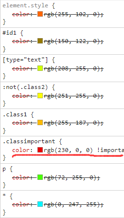
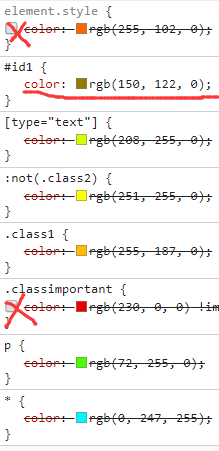
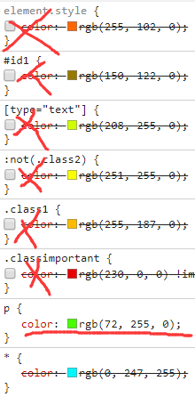

## 自己的发现

### 同级选择器（比如说两个class，都有color，加在一个元素中）

和在元素中赋值class的顺序无关，而和class在样式表中的顺序有关，下面的同级选择器会覆盖上面的。

### 特殊性计算

选择器的特殊性分成4个成分等级：a、b、c和d

- 如果样式是**行内样式**，那么a = 1
- b: **ID选择器**的总数
- c: **类、伪类和属性选择器**的数量
- d: **元素选择器和伪元素选择器**的数量
- 将a,b,c,d组成的一串数字进行比较，例如：1-0-0-0优先于0-2-0-7

> 与四位数比较大小从左到右顺序相同，但不同的是 0-0-1-0 比 0-0-0-13 优先级更高。

| 选择器                   | 特殊性   | 以10为基数的特殊性 |
| :----------------------- | :------- | :----------------- |
| Style= ""                | 1,0,0,0  | 1000               |
| #wrapper #content {}     | 0,2,0,0  | 200                |
| #content .datePosted {}  | 0,1,1,0  | 110                |
| div#content {}           | 0,1,0,1  | 101                |
| #content {}              | 0,1,0,0, | 100                |
| p.comment .dateposted {} | 0,0,2,1  | 21                 |
| p.comment {}             | 0,0,1,1  | 11                 |
| div p {}                 | 0,0,0,2  | 2                  |
| p {}                     | 0,0,0,1  | 1                  |

## 问答题

1. #### 有哪几种选择器？请举出每种选择器中你认为最典型的使用例子

   - 基础选择器：id选择器，类选择器，元素选择器
     - `#class1`
     - `div`
   - 组合选择器：
     - `div .class1{}`
     - `div>class2{}`
   - 属性选择器：
     - `[name=cars]`
     - `[name~=cars]`
   - 伪类选择器：
     - `:not(#class1)`
     - `#class1:nth-child(2n+1)`
   - 伪元素选择器：
     - `p:first-line`
     - `li:first-letter`

2. #### `.cls1` 可以选择 `<div class="cls1 cls2"></div>`吗？为什么？

   可以。因为类选择器会选择class**包含**其的元素。只要div的class属性包含cls1类，那 `.cls1` 就可以选择它。

3. #### CSS 优先级从高到底是什么样的？请给出的代码证明

   !important声明>内联样式>id选择器>类选择器=伪类选择器=属性选择器>标签选择器>通配符选择器>浏览器自定义

   类、伪类、属性的优先级取决于所在位置，后出现的优先级更高。

   ```html
   <!DOCTYPE html>
   
   <html>
   
   <head>
       <style>
           .classimportant {
               color: rgb(230, 0, 0) !important;
           }
   
           #id1 {
               color: rgb(150, 122, 0);
           }
   
           .class1 {
               color: rgb(255, 187, 0);
           }
   
           :not(.class2) {
               color: rgb(251, 255, 0);
           }
   
           [type="text"] {
               color: rgb(208, 255, 0);
           }
   
           p {
               color: rgb(72, 255, 0);
           }
   
           * {
               color: rgb(0, 247, 255);
           }
       </style>
   </head>
   
   <body>
       <p type="text" id="id1" class="class1 classimportant" style="color: rgb(255, 102, 0)">
           测试例子
       </p>
   </body>
   
   </html>
   ```

            

4. #### CSS 选择器特殊度是如何计算的？以下特殊度各是什么？

   特殊度分为四个位进行计数

   - a：内联样式
   - b：id选择器的数量
   - c：类、伪类、属性选择器的数量
   - d：元素选择器和伪元素选择器的数量
   - 高位大则特殊度更高

   `#wrapper #content` ：0，2，0，0

   `#content .datePosted`：0，1，1，0

   `div#content`：0，1，0，1

5. #### 如果计算出的特殊度完全一致，谁的优先级高那？对于以下 HTML 结构

   如果特殊度完全一致，那后出现的选择器会覆盖前一个选择器

```html
<div id="parent">
 <p id="child" class="class1">
   Text
 </p>
</div>
```

```css
#parent p.class1 {
 color: red
}
div #child.class1 {
 color: blue
}
```

最终 `<p>` 显示成什么颜色？ **会显示蓝色**

如果是如下 css 那？ **会显示位绿色**

```css
p {color: yellow}
p {color: green}
```


## 代码题

1.


2.

[网页代码地址](https://github.com/SWerllen/mfs-homework/blob/master/%E5%9F%BA%E7%A1%8012%20%E9%80%89%E6%8B%A9%E5%99%A8%E4%BB%A3%E7%A0%81/index.html)

[导航预览](https://swerllen.github.io/mfs-homework/%E5%9F%BA%E7%A1%8012%20%E9%80%89%E6%8B%A9%E5%99%A8%E4%BB%A3%E7%A0%81/)