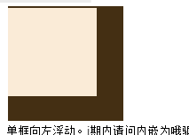
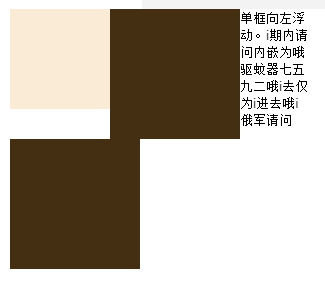
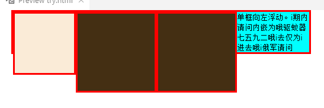
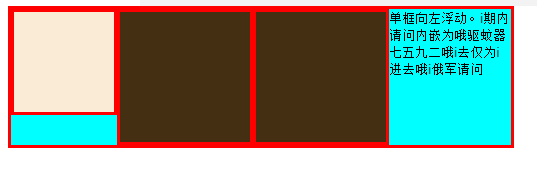
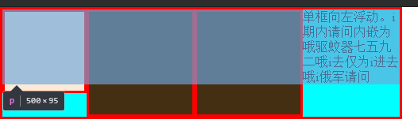
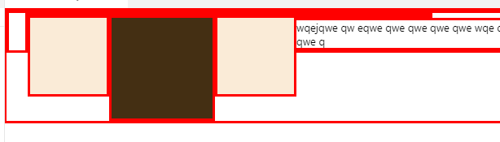

## 发现

  浮动的不影响非浮动的元素

​	 宽度不够的情况下，文字在23之间的空隙

 div的高度自适应只会根据非浮动元素来决定。浮动会使元素脱离文档流，好像不存在一样。

 当父div也设为float之后，会高度自适应。

 文字占的空间如阴影所示

 未浮动的父元素坍塌

总结理解：

浮动相当于创造了一个并行空间，其中的元素除了会占据页面**行内元素**空间之中外不产生其他作用，而同为浮动的元素会相互交互。而这个空间的元素会浮动在非浮动元素的上方。虽然文字的空间会被浮动元素占据，但是文字本身没有意识，以为被占据的空间是“有文字的”。

目前为止，html中的元素可以分为块状元素，行内元素和浮动元素，三种元素的交互方式互不相同！

一个div下的所有元素最好保持一直，要么都浮动，要么都不浮动。

父元素塌陷会导致其中的元素影响父元素外的元素，因此需要放置父元素塌陷：

而怎么防止塌陷呢？clear 或者 **BFC（Block Formatting Contexts）**

### BFC

BFC 有三个特性：

1. BFC会阻止垂直外边距（margin-top、margin-bottom）折叠。
2. BFC不会重叠浮动元素。
3. BFC可以包含浮动。

**注**：利用第一条特性可以防止外边距合并，利用第三条特性可以达到“清除浮动”的目的。

触发BFC的方式：

1. float 为 left|right ：
   - 会引起连锁反应，父元素的父元素又要考虑坍塌问题，**一般不用**
2. **overflow 为 hidden|auto|scroll** 此方法最为**常用** ：可能出现滚动条或者遮挡内容
3. display 为 table-cell|table-caption|inline-block ：无法兼容低版本浏览器
4. position 为 absolute|fixed ：改变定位方法，看需求吧

## 问答题

1. #### 什么是浮动？浮动原先是为了解决什么问题的？

   浮动属性为float，浮动元素可以使行内元素在其周围环绕，却不会占据块状元素的空间。原先是为了实现文字环绕图片的简单布局。

2. #### 浮动的元素会脱离文档流吗？

   浮动的元素会脱离文档流

3. #### 浮动会导致父元素坍陷吗？如何解决？

   如果父元素的高度未设定或不足够，浮动会溢出父元素可能遮挡父元素外其他元素。

   只要使父元素为浮动元素留出垂直空间即可，也就是清除浮动

4. #### 清除浮动有哪些方法？请至少写出4种

   - **Clear方法**：
     - 在父元素容器中禁止浮动的第一个元素中加入clear属性，设为both
     - 如果浮动元素之后没有禁止浮动元素，则添加一个空元素
     - 使用伪类的方法，在父元素容器类::after添加clear属性，并将display设为block

   - **激活BFC布局**：
     - 将父元素设为float
     - 给父元素添加overflow属性，设为hidden、auto或scroll。 最常用。
     - 将父元素的display设为`table-cell`|`table-caption`|`inline-block`
     - 修改position为absolute或fixed

## 代码题

​	[代码地址](https://github.com/SWerllen/mfs-homework/blob/master/%E5%9F%BA%E7%A1%8016%20%E6%B5%AE%E5%8A%A8/index.html) 

​	[预览地址](http://swerllen.github.io/mfs-homework/%E5%9F%BA%E7%A1%8016%20%E6%B5%AE%E5%8A%A8/index.html) 

