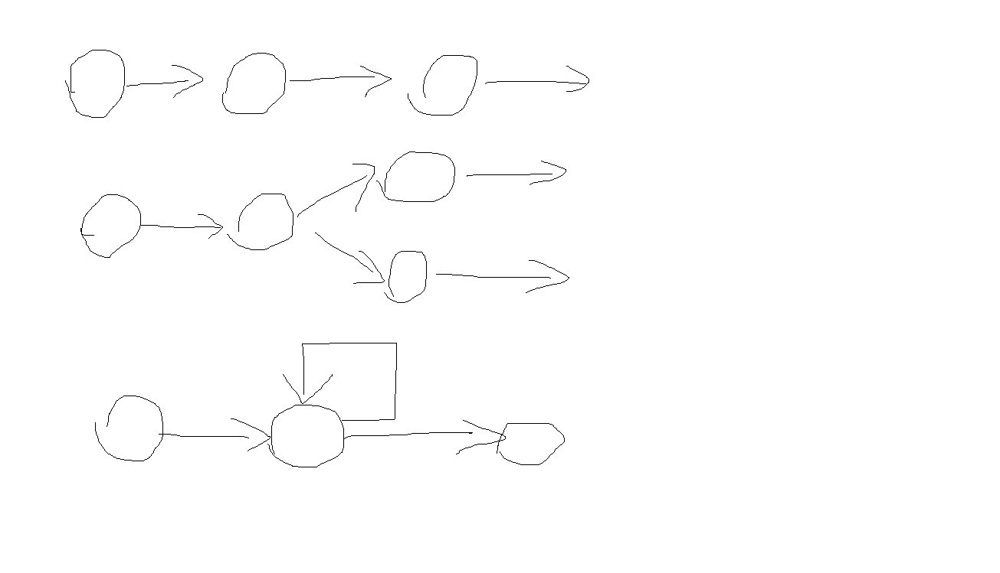

## 问答题

1. #### 程序语言中有哪三种控制结构？请用文字描述，并画图示意。

   - 顺序
   - 选择
   - 循环

   

2. #### `if ... else ...` 语句的含义是什么？

   如果(if)某条件达成，就执行某些语句；其他情况(else)，就执行这些语句。

3. #### 当 `if` 或是 `else` 子句只有一行代码时，我们可以省略代码块（`{}`）吗？如果可以省略我们应该通过什么办法使代码可读性增加

   换行，缩进。

4. #### `if` 语句支持嵌套吗？如何使用嵌套？

   支持嵌套

   在if花括号中继续使用if即可

   ```javascript
   if(){
   	if(){
   		
   	}
   }
   ```

5. #### 对于比较复杂的嵌套我们可以写成如下形式，请谈谈为什么可以写成这种形式

   ```javascript
   if()
     ...
   else if()
     ...
   else
     ...
   ```

   代码解析后按照顺序执行，先查找if后的条件，如果满足，就会执行if后的代码然后结束选择；如果不满足就会继续向后找else if，直到找到else，执行else后的代码，结束选择。

6. #### 对于多个分支的分支语句我们可以用 `switch` 语句，`switch` 语句的结构是什么样的？

   ```javascript
   switch{
       case 1:
           statement;
           break;
       case 2:
           statement;
           break;
       default:
           statement;
           break;
   }
   ```

7. #### 对于 `switch` 语句的每一个子句，我们需要使用 `break` 吗？为什么？

   看需求。

   如果只需要执行该条件子句的代码而不执行下面条件子句的代码，需要用break。

8. #### `switch` 语句可以使用哪种数据结构替代？请给出实例代码。

   可以由数组来代替。

   ```javascript
   arr=["天"，"一"，"二","三","四","五","六"];
   console.log("今天是星期"+arr[d]);
   ```

   也可以用obj的属性以键值对的形式存储条件：答案。

9. #### 对于需要多次执行的相同或者类似的代码，我们应该使用什么样的控制结构？它一共有几种形式？请给出示例代码。

   循环

   - ```javascript
     while(){
     
     }
     ```

   - ```
     for(;;){
     
     }
     ```

   - ```
     do{
     
     }while()
     ```

   - ```
     for(x in arr/str)
     ```

10. #### 对于 `for(语句1; 语句2; 语句3)` 语句，`语句1`，`语句2`, `语句3` 含义是什么？他们各是在什么时候执行？

    语句1：初始定义。

    语句2：条件判断，当语句2满足时，才继续循环。

    语句3：每循环结束一次重复进行的操作。

11. `for(var i in obj)` 含义是什么？如何使用？

    从obj的属性中挨个取出，i是obj的每一个属性名。

    ```javascript
    for(var i in obj){
    	console.log(i.toString()+obj[i].toString());
    }	//遍历对象所有属性
    ```

    

## 代码题

1. #### 请填写如下函数，使得当 `flag` 为 `true` 时，函数返回 `1`；否则返回`0`

   ```javascript
   function func(flag){
       return +flag;
   }
   ```

2. #### 请实现顺序遍历数组，发现数组元素为 `5` 时终止遍历。如数组 `[0, 1, 2, 3, 4, 5, 6]`，应该遍历 `[0, 1, 2, 3, 4]`

   ```javascript
   for(var i in arr){
   	if(i==5)
   		break;
   }
   ```

3. #### 请实现顺序遍历数组，发现数组元素为 `5` 时跳过。如数组 `[0, 1, 2, 3, 4, 5, 6]`，应该遍历 `[0, 1, 2, 3, 4, 6]`

   ```javascript
   for(var i in arr){
       if(i==5)
           continue;
   }
   ```

4. #### 已知数组 `[0, 1, 2, 3, 4, 5, 6]`，请实现代码将映射为 `["星期日", "星期一", "星期二", "星期三", "星期四", "星期五", "星期六"]`

   ```javascript
   var func=["天"，"一"，"二","三","四","五","六"]
   for(var i in arr){
   	console.log("星期"+func[i]);
   }
   ```

   

