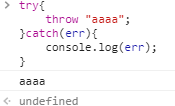

## 问答题

1. #### 什么是错误处理？为什么要错误处理？

   当程序因为各种元素出现错误时。JS 引擎通常会停止并生成一个错误消息。当 JS 抛出错误时，就可以通过catch语句捕捉这个错误。

   ```javascript
   try{
   
   }catch(err){
   
   }
   ```

   错误的发生会导致程序不能正常运行，有些是我们不能预知的。进行错误处理可以提高程序的容错率，优化用户体验，增强软件的可靠性。

2. #### 常见的错误有哪些？

   按原因分类：

   - 语法错误
   - 浏览器差异，功能缺失
   - 服务器错误
   - 未预知的用户错误输入

   按Error类型分类：

   - `Error`：基类型：用于抛出自定义错误
   - `EvalError`：当`eval`函数参数非法时报出。
   - `RangeError`：如果传入的值超出范围，报错
   - `ReferenceError`：引用错误，如变量未声明而直接使用
   - `SyntaxError`：语法错误
   - `TypeError`：类型错误，比如一个变量当函数用
   - `URIError`：

3. #### 能用 `if` 语句替代错误处理吗？如果能，请给出实例代码，如果不能，请说明原因（开放题）

   `if`不能确保兼顾所有情况，而`try`…`catch`…覆盖的范围更广，包括未预期的情况。

   比如对用户输入的内容进行验证时，if可以进行判断处理。但是却不能保证这个判断是囊括所有情况的。但如果用户输入的内容有误造成了程序出错，需要通过catch来提示用户输入错误内容而不是任由程序停止。

   总结：

   `if`是错误预防，但是预防的面小，只有两者兼顾的程序才是好程序。

4. #### 如何抛出一个错误？

   利用throw语句自定义错误。

   ```
   throw new Error("a error!");
   ```

5. #### 以下代码可以捕获异常吗？为什么？

   ```javascript
   function a(){
    throw new Error("An error")
   }
   function b(){
    a();
   }
   try{
    b()
   }catch(err){
    console.log(err)
   }
   ```

   可以呀，因为运行a方法抛出错误时，程序依然运行在`try`范围中，`catch`可以捕获到该错误。

6. #### `finally` 子句有什么用？

   无论try中的代码出没出错，finally子句都会运行，用于清理内存，比如关闭文件。

7. #### JavaScript 中 `throw` 可以抛出非 `Error` 类型的异常吗？请动手试试

   可以

    

8. #### `try catch` 语句可以嵌套吗？ 如何嵌套？

   可以嵌套。

   处理异常时，也就是catch语句可能出错，可以在catch中再写一个try…catch…。

   finally语句也可能出错，也可以再写一个try…catch…

## 代码题

1. #### 请构造一段会产生异常的代码（注意：不是一定会产生，是有一定概率产生异常），然后使用异常处理机制处理它

   ```javascript
   var sen=prompt("你好！请输入算术式：",""); 
   var b;
   try{
       var b=eval(sen);
       console.log(b);
   }catch(err){
       console.log(err);
   }
   ```

2. #### 以下代码能不能正常捕获异常，如果不能请**分析原因**并**修改**代码使其可以正常捕获异常

   ```javascript
   function asyncTask(){
    setTimeout(function(){
      throw new Error("An error")
    },1000)
   }
   try{
    asyncTask()
   } catch(err){
    console.log(err)
   }
   ```

   不能正常捕获异常

   原因：`setTimeout`是异步执行的，当其执行时，程序已经不在try…catch…的范围中了，错误已经离开的捕捉圈，因此不能正常捕获。

   ```javascript
   function asyncTask(){
       setTimeout(function(){
           try{
           	throw new Error("An error")
           }
           catch(err){
       		console.log(err)
           }
       },1000)
   }
   asyncTask();
   ```

   只有将try…catch…和问题代码绑定在一起同时异步时，也就是捕捉圈跟着错误移动，才能捕捉到错误。