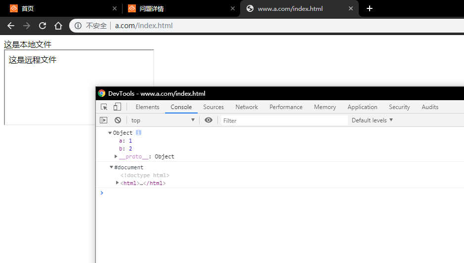

请求的地址和本网页域名不一样：跨域访问。

### 什么是域？

不同端口、不同主机名、不同主机名都算不同域名。

### 跨域：

对远程页面做一些修改，做一些收集的请求。


## 问答题

1. 了解什么是域
   假设当前显示页面地址为 http://bbs.mafengshe.com/a/b.html

   | http://bbs.mafengshe.com/a/b/c.html  | 同   |
   | ------------------------------------ | ---- |
   | http://bbs.mafengshe.com/a.html      | 同   |
   | http://bbs.mafengshe.com/pic.png     | 同   |
   | https://bbs.mafengshe.com/a/b.html   | 不同 |
   | http://bbs.mafengshe.com:81/a/b.html | 不同 |
   | http://work.mafengshe.com/a/b.html   | 不同 |
   | http://mafengshe.com/a/b/c.html      | 不同 |
   | file:///a/b.html                     | 不同 |

2. 是什么原因造成直接跨域访问失败？

   浏览器对直接跨域访问进行了限制。

3. 跨域有哪几种方法？他们的原理各是什么？各有什么局限性？（如果有的话）
   需要回答四种跨域方法

   1. **降域**：同一父域的不同子域可以通过降域的方式互相访问。局限性：无法转到其他域。（而且被调用资源也要降域声明）

   2. **`document.name`**：同域之间通过共享的数据内容进行交流。

   3. **通过`JSONP`实现跨域 **：首先本地声明一个函数，然后通过不受限制的`script`标签连结远程的js文件，在该文件中调用同名函数并传入参数，就将其数据跨域传输了。（被调用者依旧拥有主动权）。

   4. **跨域资源共享（CORS）**：后端返回头中加上允许跨源请求的标签即可实现跨域传输

      ```json
      Access-Control-Allow-Origin: *
      Access-Control-Allow-Methods: GET, POST, PUT, DELETE, PATCH 
      Access-Control-Allow-Headers: X-Custom-Header
      ```

4. 本地如何模拟跨域访问？

   通过修改host，将本机IP地址（127.0.0.1）设置为不同域名，继而模拟多个域名互相访问的环境。

   请演示并截图

   

   

   上图模拟的是降域方法

   

## 代码题

