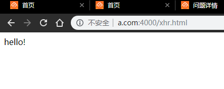

## 问答题

1. #### AJAX 是什么的简称？它和普通的 HTTP 请求有什么不同？

   Ajax是Asynchronous JavaScript and XML。

   它能够向服务器请求额外的数据而无需传输整个页面。

2. #### 传统网页的渲染模式和基于 AJAX 的网页渲染模式有何不同？

   传统网页的渲染模式：

   1. 浏览器发送请求
   2. 服务器根据浏览器的请求生成response
   3. 服务器将response传给浏览器
   4. 浏览器刷新整个页面显示最新数据

   而AJAX在浏览器与Web服务器之间使用异步数据传输从服务器获取数据。异步意味着不需要重新加载整个网页。

3. #### 如何模拟调试 AJAX 的数据

   可以使用Express来构建一个简单的本地动态服务器，在index.js处设定好路径和返回的内容。

   在本地网页中向事先设定好的端口号请求数据。

   ```javascript
   var xhr=new XMLHttpRequest();
   			xhr.open("GET","http://www.a.com:3000/json",true);
   			xhr.onreadystatechange=function(){
   				if(xhr.readyState==4 && xhr.status==200){
   					console.log(xhr.responseText)
   				}
   			}
   			xhr.send(null);
   ```

4. #### 如何兼容老浏览器创建 `XMLHttpRequest` 对象？

   利用`try`…`catch`…嵌套，如果报错，使用下一种创建方法。

5. #### `XMLHttpRequest` 对象有哪几个常用方法？分别对应的含义如何？

   - `open`：类似于初始化，给对象设置访问方法（`post`还是`get`），设置访问的url地址。
   - `send`：将请求发送至服务器，参数是请求伴随的数据，如果没有填`null`。

6. #### 常见的 HTTP 请求头有哪些？如何使用 AJAX 设置 HTTP 请求头？

   1. 常见请求头信息：
      1. `Accept`：浏览器能够处理的内容类型。
      2. `Accept-Charset`：浏览器能处理的字符集
      3. `Accept-Encoding`：浏览器能够处理的压缩编码
      4. `Accept-Language`：浏览器当前设置的语言
      5. `Connection`：浏览器与服务器的连接类型
      6. `Cookie`：当前页面的Cookie
      7. `Referer`：发送请求的页面的URI
   2. 可以使用 `setRequestHeader` 设置自定义的请求Header信息。
      1. 参数有两个，头部字段名称和该字段的值。

7. #### 如何使用 AJAX 发起 POST 请求？

   创建一个`XHR`对象，调用其`open`函数初始化，将"`POST`"作为参数。再赋予其`onreadystatechange`属性设定回调函数。

   ```javascript
   var xhr=new XMLHttpRequest();
   xhr.open("POST",'url',true);
   xhr.onreadystatechange=function(){
       if(xhr.readysatet==4 && xhr.status==200){
           //do something
       }
   }
   xhr.send("long string");
   ```

## 代码题

1. #### 请使用 AJAX 在自己的网页获取数据，并将数据以你喜欢的方法展现出来（可以渲染 dom，可以打印 console）

   #### 可以通过 GET learning-api.mafengshe.com/news 获得数据（后端已经添加跨域返回头），该地址支持如下几个参数

|    参数    | 含义                                     |
| :--------: | :--------------------------------------- |
| `pageSize` | 默认值 30（最大200），每一页的新闻条目数 |
|   `page`   | 默认 1，请求的页数                       |

```javascript
<!DOCTYPE html>
<html>
    <head>
        <meta charset="utf-8">
        <meta http-equiv="X-UA-Compatible" content="IE=edge">
        <title></title>
        <meta name="description" content="">
        <meta name="viewport" content="width=device-width, initial-scale=1">
        <style></style>
    </head>
    <body>
        <script>
			var xhr=new XMLHttpRequest();
			xhr.open("GET","http://www.a.com:3000/json",true);
			
			xhr.onreadystatechange=function(){
				if(xhr.readyState==4 && xhr.status==200){
					document.write(JSON.parse(xhr.responseText).data);
				}
			}
			xhr.send(null);
		</script>
    </body>
</html>
```

 

 