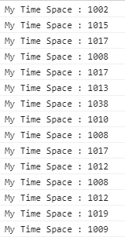
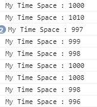

## 问答题

1. #### setTimeout 或者 setInterval 设置定时器是准时触发的吗？为什么？如果不是，他可能延时触发还是延后触发？

   不是。

   因为`JavaScript`是单线程运行的，所有的工作都是排在工作队列中。`setTimeout`和`setInterval`只是到了一定时间就将工作片段加入队列中。都是延后触发的。

2. #### 如下代码 setInterval 设置的定时器激活间隔为多少？为什么？

   ```js
   setInterval(function(){
     for(var i=0;i<1000*1000*1000;i++);//假设这行代码运行需要100ms
   },1000)
   ```

   `1s`激活一次，因为`setInterval`第二个参数设置的是激活间隔，单位是毫秒，激活的时间间隔和代码运行的时间没有直接关系。只要时间到了，定时器就会将代码加入队列，继而刷新为0重新定时，到了设定时间再次激活无论目前是不是还在运行设定的代码。

3. #### 如下代码的输出是什么？为什么？

   ```js
   setTimeout(function(){
     console.log(1);
   },0)
   console.log(2);
   ```

   2 1

   因为`setTimeout`是定时，无论时间如何短，也要先将工作片段插入工作队列才能执行，而等定时事件注册完，下一个执行的是`console.log(2)` ，而`console.log(1)` 要在其之后才加入队列。

4. #### 如下代码执行结果是什么？请解释原因

   ```js
   var t = true;
   
   window.setTimeout(function (){
      t = false;
   },1000);
   while (t){}
   alert('end');
   ```

   会陷入死循环，没有输出。

   因为进行到while(t)时，t的值为true，会进入循环，然后周而复始，一直在验证t的值，即使是定时到了，将t的赋值操作加入工作队列，也会被循环验证塞满在前，不会执行。

5. #### 我们会在很多代码里看到如下语句，请说明在什么场景下需要使用如下形式代码

   ```js
   setTimeout(function(){
     // balala
     // 这里有很多代码
     // balala
   },0)
   ```
   
   其实相当于延后处理，经常是相对于系统文档状态更新状况延后。
   
   比如在一块代码中，创建一个元素，插入到文档中，再对该元素进行选中的操作。
   
   系统一般会等待整块代码运行完再进行状态更新，而选中的操作相对于那时的文档还不存在该元素，于是不会在更新中显示。
   
   这时候就应该将选中的操作写在setTimeout中来延后操作。

## 代码题

1. #### 请用 setTimeout 模拟实现 setInterval，并说明你实现的函数和系统自带的 setInterval 有什么不同

   ```js
   var myStart=new Date();
   	
   	function mySetInterval(f,time){
   		setTimeout(function(){
   			f();
   			mySetInterval(f,time);
   		},time);
   	}
   	
   	function f(){
   		var myEnd=new Date();
   		console.log("My Time Space : " + (myEnd.getTime()-myStart.getTime()));
   		myStart=myEnd;
   		for(var x=0;x<19000000;++x);
   	}
   	
   	mySetInterval(f,1000);
   ```

    

   ```js
   setInterval(f,1000);
   ```

    

   通过对比观察，可以发现利用setTImeout得到的时间间隔要比setInterval的大一些

   这是因为mySetInterval的执行逻辑是执行了所需函数后再进行定时，所以需要考虑函数执行的时间，而setInterval是定时到了即会激活执行，不需要考虑函数执行的时间。