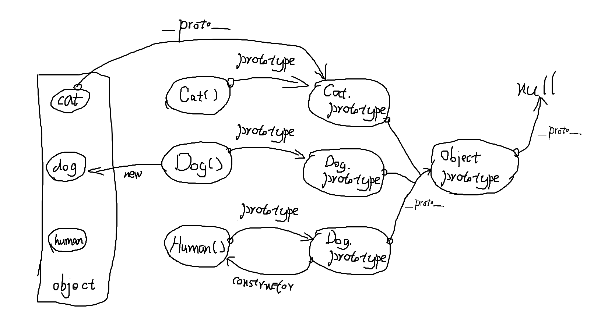

## 问答题

1. #### js中对象的属性查找机制是什么？请写出实现属性查找机制的伪代码

   - 先查自身的属性，如果找不到就找`__proto__` 的属性，如果还找不到就再找 `__proto__`的 `__proto__`的属性，一直找到null为止。

   - ```js
     function getProperty(obj,property){
     	if obj does own this property{
     		return obj[property];
     	}
     	curproto = obj.__proto__;
     	while(curproto is not null){
     		if cuproto owns this propety{
     			return curproto[property];
     		}
     	}
     	return undefined;
     }
     ```

2. #### 自学ES5的 `Object.create()` 函数，然后用自己的代码重新实现

   ```js
   function create(cls){
   	function newfather(){};		//创建一个空白类
       newfather.prototype=cls;	//让该空白类的prototype为得到的类
       return new newfather();		//返回这个空白类的实例，其实例的__proto__即为cls
       //接收方，即newclass.prototype就变成了一个实例的对象，当其实例化时，得到的对象的__proto__为该对象，即可使用该对象的__proto__中也就是cls包含的方法
   }
   ```

3. #### 使用原型链实现继承，本质通过改变对象的什么，来实现继承？

   通过改变对象的`__proto__`属性来实现继承

4. #### 当我们使用`new`关键字，其背后干了哪些事？

   ```js
   var newobj=new Object();
   newobj.__proto__=MyClass.prototype;
   MyClass.call(newobj,attribute...)
   ```

5. #### 讲义中使用 `Book.prototype = new Goods()` 实现继承有什么不完美的地方？

   1、new Goods是个对象，会包含属性。而Book构造函数中又会用Good的call来添加属性。

   2、无法给Good的传参数。

6. #### 画出代码题1的原型图，需要画到`null`

   

## 代码题

- ```js
  function Animal(){
  }
  Animal.prototype.eat=function(){
  console.log("is eating!");
  }
  Animal.prototype.sleep=function(){
  console.log("is sleeping!");
  }
  function Dog(){
  this.bark=function(){
  console.log("wang!wangwang!");
  }
  }
  function Cat(){
  this.bark=function(){
  console.log("Miao~");
  }
  }
  function Human(){
  this.speak=function(){
  console.log("你好！");
  }
  }
  Dog.prototype.__proto__=Animal.prototype;
  Cat.prototype=Object.create(Animal.prototype);
  Human.prototype=Object.create(Animal.prototype);
  ```

  

