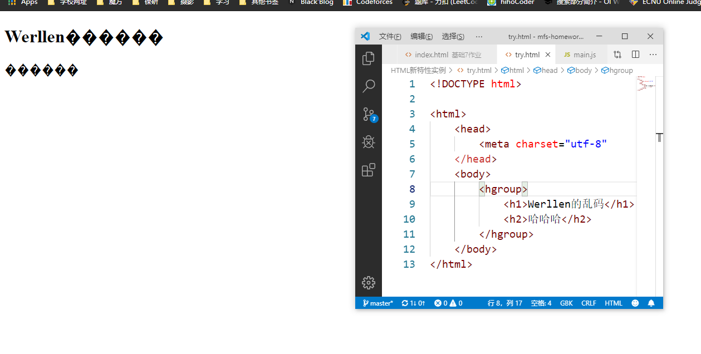
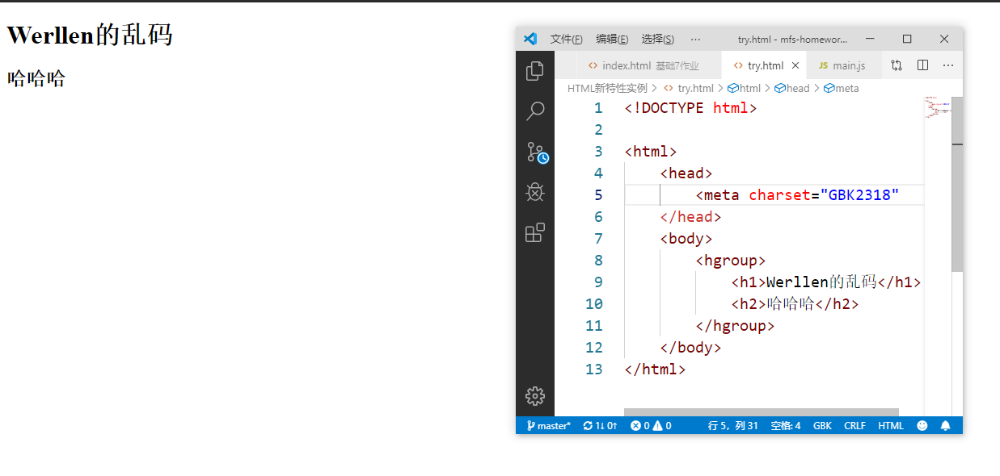
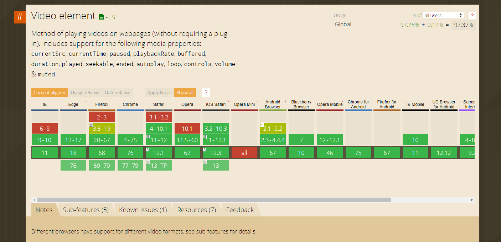

## 问答题

1. #### HTML5引入了哪些新标签？

   - `canvas>`: 画板，可以使用js在其上绘画
   - `<svg>：内联可伸缩矢量图形`
   - `<video>`：嵌入视频
   - `<audio>：嵌入音频`
   - `<hgroup>` `<article>` `<section>` `<nav>` `<aside>` `<header>` `<footer>` `<figure>` ：H5中的新的结构元素，表示文档中不同内容区块

2. #### Canvas是什么？它能干什么？

   Canvas是H5新增的html元素，可以用于在网页上绘制图形。需要使用Javascript。

3. #### SVG 是什么？它能干什么？它和 Canvas 有什么区别？

   SVG是Scalable Vector Graphics，可伸缩矢量图形。它用于定义用于网络的基于矢量图形。

   SVG拥有矢量图的特点，可以被无限放大而不会失真，可以被检索，可以通过文本编辑器来创建和修改，可以变形。

   Canvas是JS代码动态画出的，可以使用函数，进行响应，可以动态展现。被画出来的图像被放大后会失真。

   SVG需要在html代码中描述好，才可以展现出来。放大不会失真。

4. #### 如何在网页上播放视频、音频？

   使用 `<video>`和 `<audio>` 标签对视频，音频进行引用。即可在网页中播放视频和音频。

5. #### HTML5引入了哪些结构性元素？他们各有哪些含义？

   `<hgroup>` `<article>` `<section>` `<nav>` `<aside>` `<header>` `<footer>` `<figure>` 

   `<hgroup>` ：将标题及其子标题进行分组

   `<article>`：表示这一部分是在页面中独立的可单独被外部引用的内容

   `<section>`：表示页面中的一个内容区块

   `<nav>`：表示页面中导航链接的部分

   `<aside>`：表示 `<article>` 之外，与其内容相关的辅助信息，譬如引用、侧边栏、广告、导航条等有别于主要内容的部分

   `<header>` ：表示一个内容区块或整个页面的标题

   `<footer>`：一个内容区块或整个页面的脚注

   `<figure>` ：表示一段独立的流内容

6. #### 如果网页发生乱码，我们应该检查什么？具体该怎么做？

   检查编码，具体用文本编辑器打开html文件，查看编码格式，再与meta元素中的charset属性进行比较，如有出入，改正charset。

   #### 请写出一个包含乱码的网页，并合理设置字符集编码，使得它可以正常显示

   

   改正charset

   

7. #### 在哪里查浏览器对标签或属性的支持程度? 请查询`<video>`标签的浏览器兼容性，并截图

   